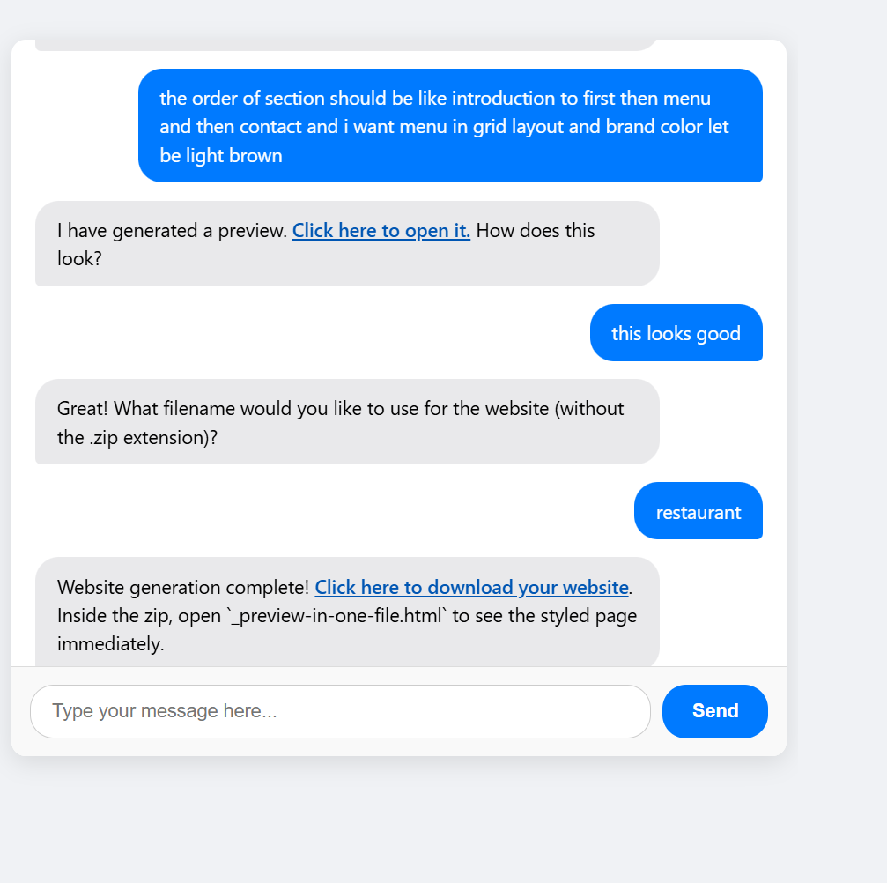

# AI-Powered Restaurant Website Generator

An intelligent assistant that helps you build beautiful, static restaurant websites — all through natural conversation. Built using Flask, LangChain, and Google Gemini (LLM).

---

##   Features

- Chat with an AI to input restaurant name, menu, contact info, and style
- Uses LangChain + Gemini 2.0 Flash to generate HTML and CSS
- Fully custom layout with section ordering, themes, and brand color
- Live preview of the site with all styling
- Download full .zip website with ready-to-use HTML & CSS

---

##  Tech Stack

- Backend: Python, Flask, LangChain
- LLM: Google Gemini via `langchain_google_genai`
- Memory: `ConversationBufferWindowMemory` for multi-turn chats
- Templating: Jinja2
- Sanitization: Bleach for safe HTML rendering
- UI: Basic HTML + JS chat interface

## Author

**Mayuresh Kulkarni** 
 * Data Scientist
 * B.Tech in Mechanical Engineering  
 * Passionate about AI, Python, Flask Development, and Data Science  
 * Email: kulkarnim522@gmail.com
 * [LinkedIn](https://www.linkedin.com/in/mayuresh-kulkarni-41b17022a/)  
 * [GitHub](https://github.com/mayureshkulkarni-github)
